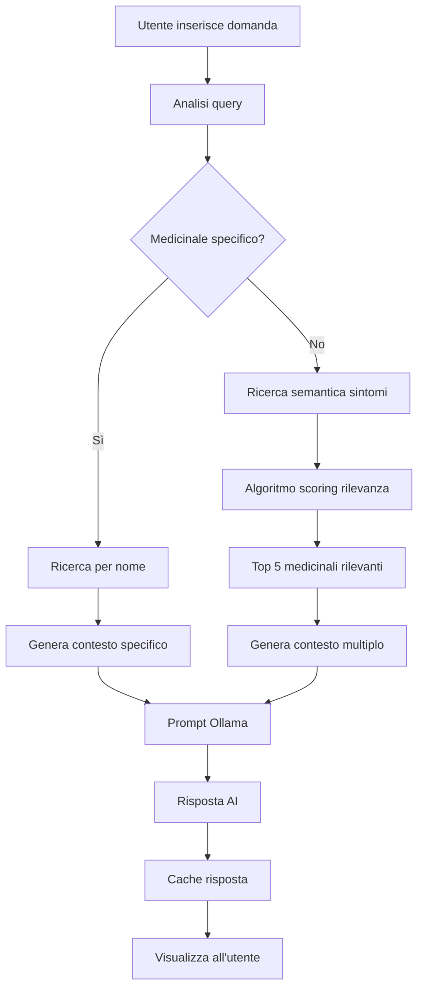

# 💊 Dashboard Medicinali con Chatbot AI

Una dashboard interattiva per la consultazione di medicinali con assistente virtuale integrato, sviluppata in Python con Streamlit e Ollama.

## 🚀 Caratteristiche Principali

### 📊 Dashboard Completa
- **Visualizzazione dati**: Tabella interattiva con tutti i medicinali del database
- **Ricerca avanzata**: Filtro per nome del medicinale in tempo reale
- **Statistiche dettagliate**: Grafici delle recensioni e panoramica generale
- **Dettagli medicinale**: Informazioni complete su composizione, utilizzi ed effetti collaterali

### 🤖 Chatbot AI Integrato
- **Assistente virtuale**: Powered by Ollama (modello Mistral)
- **Ricerca semantica**: Algoritmo avanzato per trovare medicinali rilevanti
- **Risposte contestuali**: Basate sui dati reali del database
- **Sicurezza medica**: Sempre raccomanda la consultazione di un medico

### 🌍 Supporto Multilingua
- **Italiano/Inglese**: Toggle dinamico per cambiare lingua
- **Traduzioni automatiche**: Dataset tradotto automaticamente
- **UI localizzata**: Interfaccia completamente tradotta

### 🎨 Interfaccia Moderna
- **Layout responsive**: Ottimizzato per desktop e mobile
- **Design intuitivo**: Colori e icone per una UX ottimale
- **Sospensione UI**: Durante l'elaborazione del chatbot
- **Container personalizzati**: Area chat con bordi e scroll

## 📋 Requisiti di Sistema

### Software Necessario
```bash
# Python 3.8+
python --version

# Ollama (per il chatbot AI)
# Scarica da: https://ollama.ai/
ollama --version

# Modello Mistral
ollama pull mistral
```

### Dipendenze Python
```bash
pip install streamlit
pip install pandas
pip install plotly
pip install deep-translator
pip install fastapi
pip install uvicorn
pip install requests
pip install nest-asyncio
pip install pydantic
```

## 🛠️ Installazione e Configurazione

### 1. Clona il Repository
```bash
git clone <repository-url>
cd dashboard-medicinali
```

### 2. Installa le Dipendenze
```bash
pip install -r requirements.txt
```

### 3. Prepara i Dati
Assicurati di avere il file `Medicine_Details.csv` nella directory principale con le seguenti colonne:
- `Medicine Name`: Nome del medicinale
- `Composition`: Composizione chimica
- `Uses`: Utilizzi (in inglese)
- `Side_effects`: Effetti collaterali (in inglese)
- `Image URL`: URL dell'immagine
- `Manufacturer`: Produttore
- `Excellent Review %`: Percentuale recensioni eccellenti
- `Average Review %`: Percentuale recensioni nella media
- `Poor Review %`: Percentuale recensioni scarse

### 4. Avvia Ollama
```bash
# In un terminale separato
ollama serve

# Verifica che Mistral sia disponibile
ollama list
```

### 5. Avvia l'Applicazione
```bash
streamlit run "chatbot medicofixing.py"
```

## 🏗️ Architettura del Sistema

### Componenti Principali

#### 1. **Frontend (Streamlit)**
- `chatbot medicofixing.py`: File principale dell'applicazione
- Layout a colonne per statistiche e chatbot
- Gestione dello stato dell'applicazione
- CSS personalizzato per styling avanzato

#### 2. **Backend AI (Ollama + FastAPI)**
- Server FastAPI integrato per gestire le richieste AI
- Connessione a Ollama per generazione risposte
- Cache intelligente per ottimizzare le performance
- Algoritmo di ricerca semantica personalizzato

#### 3. **Gestione Dati**
- Caricamento e caching del dataset
- Traduzione automatica con Google Translator
- Preprocessing e indicizzazione per ricerche rapide

### Flusso di Elaborazione Chatbot



## 🔧 Funzionalità Avanzate

### Algoritmo di Ricerca Semantica
Il chatbot utilizza un algoritmo proprietario che:
1. **Analizza la query** per identificare sintomi e parti del corpo
2. **Cerca nei campi** nome, utilizzi e composizione
3. **Assegna punteggi** basati su rilevanza semantica
4. **Bonus per principi attivi** comuni (ibuprofen, paracetamol, etc.)
5. **Restituisce top 5** medicinali più rilevanti

### Sistema di Cache Intelligente
- **Cache delle risposte**: Evita chiamate duplicate a Ollama
- **Similarità delle query**: Riutilizza risposte per domande simili
- **Ottimizzazione performance**: Riduce i tempi di risposta

### Gestione Stati UI
- **Sospensione globale**: Durante elaborazione chatbot
- **Stati indipendenti**: Chatbot e dettagli medicinale separati
- **Feedback visivo**: Indicatori di caricamento e elaborazione

## 📱 Guida all'Uso

### Ricerca Medicinali
1. Usa la **barra di ricerca** nella sidebar per filtrare per nome
2. Visualizza i risultati nella **tabella principale**
3. Seleziona un medicinale per vedere i **dettagli completi**

### Chatbot AI
1. Scrivi la tua domanda nella **barra input** in fondo alla colonna chatbot
2. Il sistema **analizza automaticamente** la richiesta
3. Ricevi una **risposta contestualizzata** basata sui dati reali
4. Usa il **pulsante cestino** 🗑️ per pulire la conversazione

### Esempi di Domande
- "Che medicinale posso assumere per il dolore al ginocchio?"
- "Dimmi tutto su Paracetamol"
- "Quali sono gli effetti collaterali di Ibuprofen?"
- "Ho mal di testa, cosa mi consigli?"

## 🎯 Statistiche e Metriche

### Panoramica Generale
- **Totale Medicinali**: Numero totale nel database
- **Produttori Unici**: Diversità del dataset
- **Media Eccellenti**: Percentuale media recensioni positive
- **Miglior Medicinale**: Quello con più recensioni eccellenti

### Grafici Interattivi
- **Distribuzione Recensioni**: Grafico a torta con percentuali
- **Metriche Responsive**: Layout 2x2 ottimizzato
- **Aggiornamento Dinamico**: Basato sui filtri applicati

## 🔒 Sicurezza e Disclaimer

### Avvertenze Mediche
- ⚠️ **Non sostituisce il parere medico**: Sempre consultare un professionista
- ⚠️ **Solo informazioni generali**: Non prescrizioni o dosaggi
- ⚠️ **Consultazione obbligatoria**: Per qualsiasi utilizzo di medicinali

### Sicurezza Dati
- **Nessun dato personale**: Non vengono memorizzate informazioni sensibili
- **Cache locale**: Risposte salvate solo in sessione
- **Connessioni sicure**: Comunicazione criptata con Ollama

## 🐛 Risoluzione Problemi

### Problemi Comuni

#### Ollama non risponde
```bash
# Verifica che Ollama sia in esecuzione
curl http://localhost:11434/api/tags

# Riavvia Ollama se necessario
ollama serve
```

#### Errori di traduzione
- Verifica la connessione internet per Google Translator
- Il sistema fallback mantiene il testo originale in inglese

#### Performance lente
- Aumenta la RAM disponibile per Ollama
- Riduci il numero di medicinali nel dataset per test

#### Container chat non funziona
- Verifica che JavaScript sia abilitato nel browser
- Apri la console (F12) per vedere eventuali errori

## 📈 Roadmap Futura

### Funzionalità Pianificate
- [ ] **Database esteso**: Più medicinali e informazioni
- [ ] **Ricerca vocale**: Input tramite microfono
- [ ] **Export risultati**: PDF e Excel delle ricerche
- [ ] **Notifiche**: Alert per interazioni farmacologiche
- [ ] **API pubblica**: Endpoint per integrazioni esterne

### Miglioramenti Tecnici
- [ ] **Database SQL**: Migrazione da CSV a database relazionale
- [ ] **Caching Redis**: Sistema di cache distribuito
- [ ] **Docker**: Containerizzazione completa
- [ ] **Testing**: Suite di test automatizzati
- [ ] **CI/CD**: Pipeline di deployment automatico

## 👥 Contributi

### Come Contribuire
1. Fork del repository
2. Crea un branch per la feature (`git checkout -b feature/AmazingFeature`)
3. Commit delle modifiche (`git commit -m 'Add some AmazingFeature'`)
4. Push al branch (`git push origin feature/AmazingFeature`)
5. Apri una Pull Request

### Linee Guida
- Segui le convenzioni di codice Python (PEP 8)
- Aggiungi documentazione per nuove funzionalità
- Testa le modifiche prima del commit
- Mantieni la compatibilità con le versioni esistenti

## 📄 Licenza

Questo progetto è distribuito sotto licenza MIT. Vedi il file `LICENSE` per maggiori dettagli.

## 📞 Supporto

Per supporto, bug report o richieste di funzionalità:
- Apri un **Issue** su GitHub
- Contatta il team di sviluppo
- Consulta la documentazione tecnica

---

**Sviluppato con ❤️ usando Python, Streamlit e Ollama**
